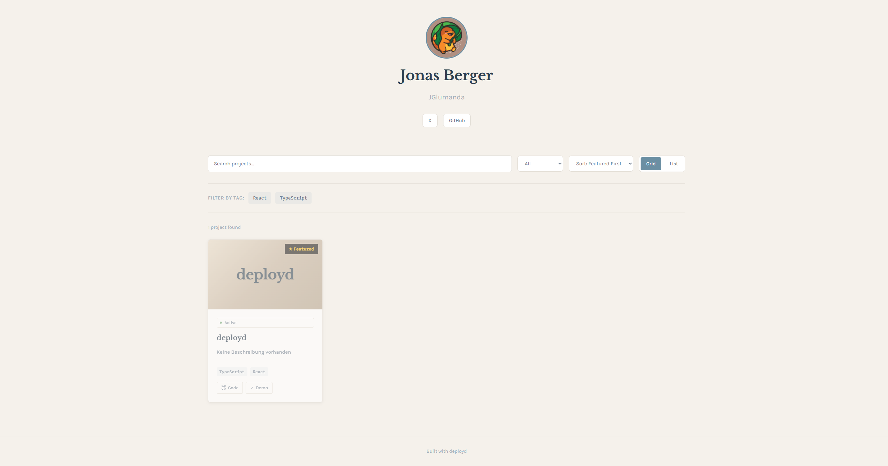
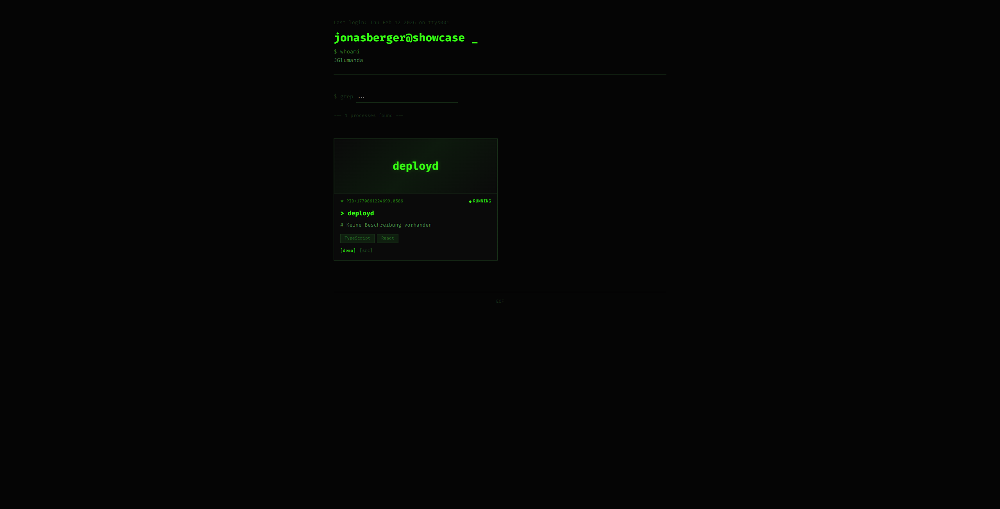
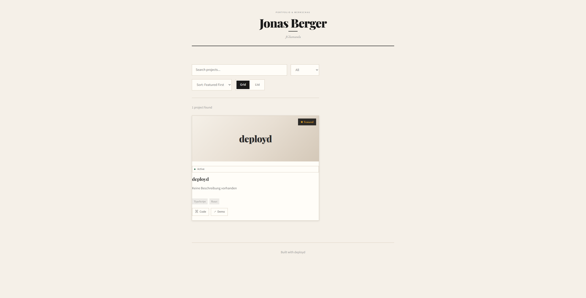
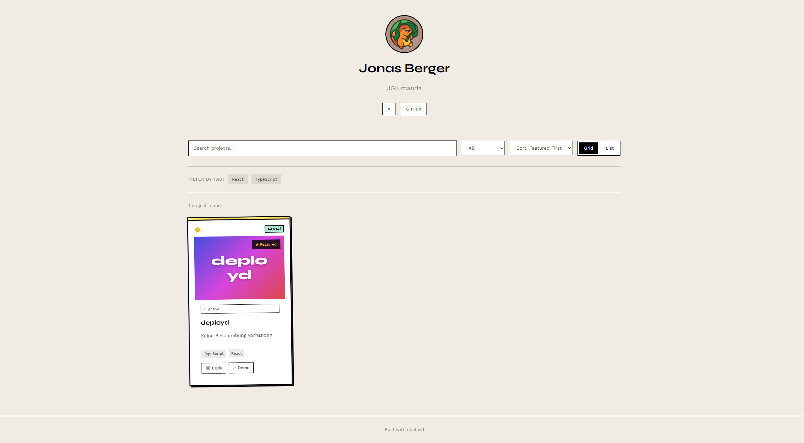
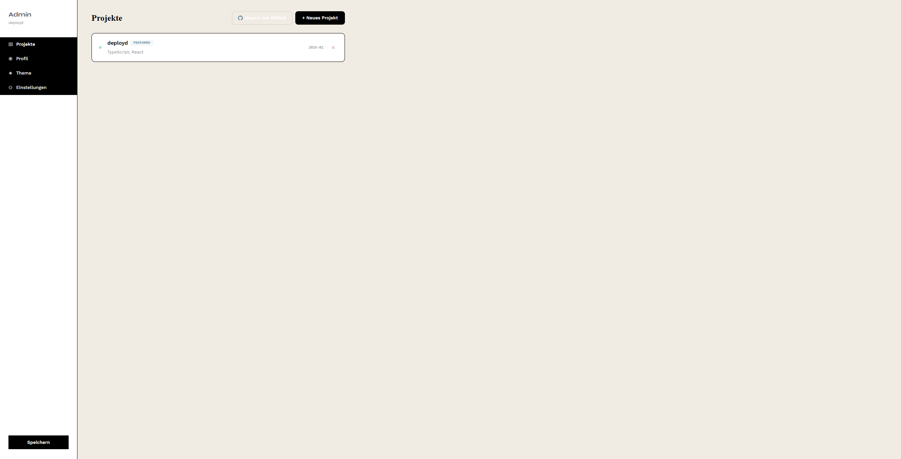

<div align="center">

# 🎨 deployd

**A beautiful, self-hostable portfolio platform with 4 stunning themes**

[](https://opensource.org/licenses/MIT)
[](https://www.typescriptlang.org/)
[](https://react.dev/)
[](https://vitejs.dev/)
[](https://www.docker.com/)
[](https://github.com/jglumanda/deployd/pkgs/container/deployd)

[Demo](#-themes) • [Quick Start](#-quick-start) • [Documentation](#-documentation) • [Contributing](#-contributing)

</div>

---

## ✨ Features

<table>
<tr>
<td width="50%">

### 🎭 **4 Beautiful Themes**
Switch between Nordic, Terminal, Editorial, and Brutalist themes instantly

### 🔌 **GitHub Integration**
Import projects, profile data, and GitHub Profile README directly from your account

### 📝 **Markdown & HTML Support**
Full Markdown rendering with HTML pass-through for badges, images, and custom formatting

</td>
<td width="50%">

### 🎯 **Admin Panel**
Full-featured editor with real-time preview

### 🏷️ **Tag Icons**
113 pre-configured tech stack icons with support for custom icons

### 📊 **Health Monitoring**
Optional live status checks for all your project URLs

### 🚀 **Production Ready**
Docker deployment, automated builds via GitHub Actions

</td>
</tr>
</table>

---

## 🚀 Quick Start

### 🏠 Local Development (HTTP)

**Using Pre-built Image** (fastest)

```bash
# Pull and run the latest image
docker run -d \
  -p 3000:3000 \
  -e ADMIN_PASSWORD=admin \
  -v $(pwd)/config.json:/app/config.json \
  ghcr.io/jglumanda/deployd:latest

# Open http://localhost:3000
```

**Or with docker-compose**

```bash
# Clone the repository
git clone https://github.com/jglumanda/deployd.git
cd deployd

# Start with docker-compose (config.json is automatically created!)
docker-compose up -d

# Open http://localhost:3000
# Your config is in data/config.json and persists across restarts
```

### 🔧 With Your Own Reverse Proxy

**Already have Nginx, Traefik, or Caddy?** Use the simple setup:

```bash
# 1. Clone repository
git clone https://github.com/jglumanda/deployd.git
cd deployd

# 2. (Optional) Customize config before first start
cp config/config.default.json data/config.json
nano data/config.json  # Edit with your info
# Or skip this - config.json will be auto-created on first run!

# 3. Set environment variables
export ADMIN_PASSWORD=your-secure-password
export GITHUB_TOKEN=your-github-token  # Optional

# 4. Start the app (port 3000)
docker-compose -f docker/docker-compose.simple.yml up -d

# ✅ App running on http://localhost:3000
# Now configure your reverse proxy to point to port 3000
```

**Features:**
- ✅ Just the app, no bundled reverse proxy
- ✅ Uses pre-built image from GitHub Container Registry
- ✅ Integrates with your existing infrastructure
- ✅ Port 3000 by default (configurable)

### 🌐 Production (HTTPS) - **Recommended**

**Automatic HTTPS with Caddy** (5 minutes)

```bash
# 1. Clone repository
git clone https://github.com/jglumanda/deployd.git
cd deployd

# 2. Configure environment
cp config/.env.production.example .env
nano .env  # Set DOMAIN and ADMIN_PASSWORD

# 3. Start with automatic HTTPS!
docker-compose -f docker/docker-compose.prod.yml up -d

# ✅ Opens automatically at https://yourdomain.com
```

**Features:**
- ✅ Automatic HTTPS (Let's Encrypt)
- ✅ Auto-renewal of certificates
- ✅ Rate limiting (5 failed logins / 15 min)
- ✅ Password hashing (bcrypt)
- ✅ Security headers
- ✅ CORS protection

📖 **Full guide:** See [docs/PRODUCTION.md](docs/PRODUCTION.md) for detailed deployment instructions

### Local Development

```bash
# Install dependencies
npm install

# Set admin password (optional)
export ADMIN_PASSWORD=your-password

# Start dev servers (frontend + backend)
npm run dev

# Open http://localhost:5173
```

**That's it!** 🎉 Your portfolio is now running.

---

## 🎨 Themes

Switch between 4 professionally designed themes to match your style. **All themes now support full Markdown bio rendering** with HTML, badges, and images!

### Nordic 🌊
<sup>Scandinavian-inspired design with pastel colors and serif typography</sup>

```
Warm beiges • Soft shadows • Elegant serifs
Perfect for: Professional portfolios, design agencies
Bio: Centered container with left-aligned content
```

### Terminal 💻
<sup>Retro CLI aesthetic with green-on-black and monospace fonts</sup>

```
Matrix green • Scanline effects • Monospace everywhere
Perfect for: Developers, hackers, system admins
Bio: Centered with "$ whoami" command prefix
```

### Editorial 📰
<sup>Magazine-style layout with sophisticated typography</sup>

```
Clean header • Editorial fonts • Elegant spacing
Perfect for: Writers, journalists, content creators
Bio: Centered with italic serif typography
```

### Brutalist 🎨
<sup>Bold, unapologetic design with thick borders and vibrant colors</sup>

```
Thick borders • Offset shadows • Card rotation
Perfect for: Artists, designers, creative studios
Bio: Centered with bold visual style
```

> 💡 **Tip:** Every theme is fully customizable through CSS variables. All themes render your Markdown bio exactly as it appears on GitHub, with full support for HTML tags, badges, images, and animated SVGs!

---

## 📸 Screenshots

<details>
<summary><b>Click to see all 4 themes in action</b></summary>

### Nordic Theme


### Terminal Theme


### Editorial Theme


### Brutalist Theme


### Admin Panel


</details>

---

## 🔐 Security Features

deployd includes production-ready security features out of the box:

### Authentication & Authorization

| Feature | Implementation | Protection |
|---------|----------------|------------|
| **Password Hashing** | bcrypt with salt | Passwords never stored in plaintext |
| **Rate Limiting** | 5 attempts / 15 min | Prevents brute-force attacks |
| **Bearer Token Auth** | Per-request validation | Secure API access |
| **Session Management** | Memory-only storage | Cleared on browser close |

### Network Security

| Feature | Status | Details |
|---------|--------|---------|
| **HTTPS** | ✅ Production | Automatic with Caddy (Let's Encrypt) |
| **HTTP** | ⚠️ Dev only | Local development only |
| **CORS** | ✅ Configurable | Restrict to your domain |
| **Security Headers** | ✅ Enabled | X-Frame-Options, X-Content-Type-Options, etc. |

### Let's Encrypt Integration

- **Automatic HTTPS**: Caddy handles certificate issuance & renewal
- **Rate Limit Protection**: Certificates persisted in Docker volume
- **Staging Environment**: Test without hitting rate limits
- **Zero Configuration**: Just set your domain name

**Rate Limits:** 50 certificates per domain/week (not an issue with volume persistence)

📖 **Full documentation:** [PRODUCTION.md](PRODUCTION.md)

---

## 🛠️ Tech Stack

<div align="center">

[](https://www.typescriptlang.org/)
[](https://react.dev/)
[](https://vitejs.dev/)
[](https://expressjs.com/)
[](https://www.docker.com/)

</div>

| Layer | Technology | Version |
|-------|-----------|---------|
| **Frontend** | React | 19 |
| **Build Tool** | Vite | 8 |
| **Language** | TypeScript | 5.9 |
| **Routing** | React Router | 7 |
| **Backend** | Express | 5 |
| **Runtime** | Node.js | 20+ |
| **Container** | Docker | Latest |

---

## 📖 Documentation

### Table of Contents

- [Installation](#installation)
- [Configuration](#configuration)
- [Admin Panel](#admin-panel)
- [API Reference](#api-reference)
- [Theming](#theming)
- [Deployment](#deployment)
- [Tag Icons](#️-tag-icons)

---

### Installation

#### Prerequisites

- **Node.js** 20 or higher
- **npm**, **yarn**, or **pnpm**
- **Docker** (optional, for containerized deployment)

#### Install Dependencies

```bash
npm install
```

#### Environment Variables

Create a `.env` file in the project root:

```env
# Admin panel password (optional, but recommended)
ADMIN_PASSWORD=your-secure-password

# GitHub Personal Access Token (optional)
# Increases API rate limit from 60 to 5000 requests/hour
GITHUB_TOKEN=ghp_your_github_token

# Server configuration
PORT=3000
NODE_ENV=production
```

| Variable | Required | Default | Description |
|----------|----------|---------|-------------|
| `ADMIN_PASSWORD` | No | `""` | Password for `/admin` access |
| `GITHUB_TOKEN` | No | `""` | GitHub PAT for higher rate limits |
| `PORT` | No | `3000` | Server port |
| `NODE_ENV` | No | `development` | Environment mode |

---

### Configuration

All data is stored in `config.json` at the project root.

#### First Time Setup

When you pull the Docker image and run it **without mounting a config.json**, you'll see a default placeholder configuration that prompts you to set up the admin panel:

- **Username**: deployd
- **Tagline**: "Successfully deployed! Please visit /admin to configure your showcase"
- **Sample project** to demonstrate the layout

**To customize your showcase**, create your own `config.json`:

```bash
# Option 1: Copy the default template
curl -O https://raw.githubusercontent.com/jglumanda/deployd/main/config.default.json
mv config.default.json config.json

# Option 2: Create from scratch (see structure below)

# Then mount it when running Docker
docker run -d \
  -p 3000:3000 \
  -v $(pwd)/config.json:/app/config.json \
  ghcr.io/jglumanda/deployd:latest
```

#### Config Structure

```json
{
  "profile": {
    "name": "Your Name",
    "tagline": "Full-Stack Developer & Designer",
    "bio": "# About Me\n\nBuilding beautiful web experiences with modern technologies.\n\n## Skills\n- React & TypeScript\n- Node.js & Express\n- Docker & DevOps\n\n**Note**: Bio supports full Markdown with HTML tags!",
    "avatar": "https://avatars.githubusercontent.com/u/your-id",
    "links": {
      "github": "https://github.com/username",
      "linkedin": "https://linkedin.com/in/username",
      "email": "mailto:your@email.com",
      "website": "https://yoursite.com"
    }
  },
  "projects": [
    {
      "id": 1,
      "title": "Amazing Project",
      "description": "A revolutionary app that changes everything.",
      "tags": ["React", "TypeScript", "Docker"],
      "status": "active",
      "featured": true,
      "links": {
        "live": "https://demo.com",
        "github": "https://github.com/user/repo",
        "docs": "https://docs.com"
      },
      "image": "https://...",
      "date": "2026-02"
    }
  ],
  "theme": {
    "active": "nordic"
  },
  "settings": {
    "maxVisibleTags": 4,
    "cardDescriptionMaxChars": 120,
    "cardTitleMaxLines": 1,
    "healthCheck": {
      "enabled": true,
      "intervalMinutes": 5
    },
    "tags": {
      "predefined": [
        {
          "name": "React",
          "color": "#61DAFB",
          "icon": "https://cdn.simpleicons.org/react/61dafb"
        },
        {
          "name": "TypeScript",
          "color": "#3178C6",
          "icon": "https://cdn.simpleicons.org/typescript/3178c6"
        }
      ],
      "custom": []
    }
  }
}
```

---

### Admin Panel

Access the admin panel at **`/admin`**. You'll be prompted for the password if `ADMIN_PASSWORD` is set.

#### Features

| Section | Description |
|---------|-------------|
| **Projects** | Add, edit, delete projects. Import from GitHub. |
| **Profile** | Edit profile info with Markdown support. Import profile data and GitHub Profile README. |
| **Themes** | Switch between 4 built-in themes, all with full Markdown bio support. |
| **Settings** | Configure display options, health checks, manage 113+ tags with icons. |

#### GitHub Integration

<details>
<summary><b>Import Projects from GitHub</b></summary>

1. Go to Admin Panel → Projects
2. Click "Import from GitHub"
3. Enter your GitHub username
4. Select repositories to import
5. Click "Import X Projects"

Projects are auto-filled with:
- Repository name as title
- Description from GitHub
- Topics as tags
- Language as a tag
- Repository URL as GitHub link
- Homepage as live link (if set)
- Archive status

</details>

<details>
<summary><b>Import Profile from GitHub</b></summary>

1. Go to Admin Panel → Profile
2. Click "Import from GitHub"
3. Enter your GitHub username
4. Select which fields to import
5. Click "Import Selected Fields"

Fields available:
- Name
- Bio (plain text from GitHub profile)
- **Profile README** (full Markdown with badges, images, and HTML)
- Avatar
- GitHub URL
- Website
- Twitter/X
- LinkedIn

**Profile README Support**: Import your GitHub Profile README (from `username/username` repository) as your bio. Supports:
- Full Markdown syntax (headings, lists, links, code blocks)
- HTML tags (images, divs, line breaks, etc.)
- Badges from shields.io and similar services
- GitHub contribution graphs and animated SVGs
- Visitor counters and dynamic badges

The bio renders exactly as it appears on your GitHub profile!

</details>

---

### API Reference

All API endpoints are available at `/api/*`.

#### Public Endpoints

```bash
# Get current configuration
GET /api/config

# Check if a URL is online
GET /api/health?url=https://example.com

# List available themes
GET /api/themes

# Get GitHub user data
GET /api/github/user/:username

# Get GitHub repositories
GET /api/github/repos/:username

# Get GitHub social accounts
GET /api/github/socials/:username

# Get GitHub Profile README (from username/username repository)
GET /api/github/readme/:username
```

#### Authenticated Endpoints

```bash
# Update configuration (requires Bearer token)
PUT /api/config
Authorization: Bearer your-admin-password

Content-Type: application/json
{
  "profile": { ... },
  "projects": [ ... ],
  "theme": { "active": "nordic" },
  "settings": { ... }
}
```

#### Response Formats

<details>
<summary><b>GET /api/config</b></summary>

```json
{
  "profile": { ... },
  "projects": [ ... ],
  "theme": { "active": "nordic" },
  "settings": { ... }
}
```

</details>

<details>
<summary><b>GET /api/health?url=...</b></summary>

```json
{
  "online": true,
  "statusCode": 200
}
```

```json
{
  "online": false,
  "error": "ENOTFOUND"
}
```

</details>

---

### Theming

Create custom themes by adding to `frontend/src/themes/`:

```typescript
// frontend/src/themes/custom/index.ts
import type { Theme } from '@core/types'

export const custom: Theme = {
  name: 'custom',
  displayName: 'Custom Theme',
  description: 'Your custom theme description',
  tokens: {
    colors: {
      bg: '#ffffff',
      bgAlt: '#f5f5f5',
      card: '#ffffff',
      cardHover: '#fafafa',
      border: '#e0e0e0',
      text: '#333333',
      textMuted: '#666666',
      heading: '#1a1a1a',
      accent: '#0066cc',
      accentSoft: '#e6f2ff',
      error: '#dc2626',
      errorBg: '#fee2e2',
      statusActive: '#10b981',
      statusWip: '#f59e0b',
      statusArchived: '#6b7280',
      // Input field colors
      inputBg: '#ffffff',
      inputText: '#333333',
      inputBorder: '#d1d5db',
      inputBorderFocus: '#0066cc',
      inputPlaceholder: '#9ca3af'
    },
    fonts: {
      heading: "'Inter', sans-serif",
      body: "'Inter', sans-serif",
      mono: "'Fira Code', monospace",
      googleFontsUrls: [
        'https://fonts.googleapis.com/css2?family=Inter:wght@400;500;600;700&display=swap'
      ]
    },
    radius: {
      sm: '4px',
      md: '8px',
      lg: '12px'
    },
    spacing: {
      cardPadding: '24px',
      gridGap: '18px',
      sectionGap: '56px',
      section: '80px'  // NEW: Section vertical spacing
    }
  },
  effects: {
    scanlines: false,          // Terminal-style scanline effect
    cardRotation: false,       // Card tilt on hover (boolean or degrees)
    animationStyle: 'fade',    // 'fade' | 'slide' | 'pop' | 'type'
    cardShadow: 'soft',        // 'none' | 'soft' | 'medium' | 'hard' | 'offset'
    showTagIcons: true         // Show icons next to tag names (default: false)
  },
  // NEW: Custom project image styling
  projectImageStyle: {
    background: 'linear-gradient(135deg, #667eea 0%, #764ba2 100%)',
    titleColor: '#ffffff',
    titleShadow: '0 2px 4px rgba(0,0,0,0.2)'
  },
  // NEW: Override default components
  overrides: {
    // CardWrapper: CustomCardWrapper,    // Custom project card
    // HeroLayout: CustomHeroLayout,      // Custom hero section
    // PageLayout: CustomPageLayout,      // Custom page layout
    // ModalWrapper: CustomModalWrapper   // Custom modal
  }
}
```

Register your theme in `frontend/src/themes/index.ts`:

```typescript
import { custom } from './custom'

registerTheme(custom)
```

---

### Deployment

#### Docker (Recommended)

**Option 1: Use Pre-built Image from GitHub Container Registry**

```bash
# Pull the latest image
docker pull ghcr.io/jglumanda/deployd:latest

# Run the container
docker run -d \
  -p 3000:3000 \
  -e ADMIN_PASSWORD=your-password \
  -e GITHUB_TOKEN=your-token \
  -v $(pwd)/config.json:/app/config.json \
  --name deployd \
  ghcr.io/jglumanda/deployd:latest
```

**Option 2: Build from Source**

```bash
# Build the image locally
docker build -t deployd .

# Run the container
docker run -d \
  -p 3000:3000 \
  -e ADMIN_PASSWORD=your-password \
  -e GITHUB_TOKEN=your-token \
  -v $(pwd)/config.json:/app/config.json \
  --name deployd \
  deployd
```

#### Docker Compose

**Option 1: Use Pre-built Image**

```yaml
services:
  showcase:
    image: ghcr.io/jglumanda/deployd:latest
    ports:
      - "3000:3000"
    environment:
      - ADMIN_PASSWORD=${ADMIN_PASSWORD:-admin}
      - GITHUB_TOKEN=${GITHUB_TOKEN:-}
    volumes:
      - ./config.json:/app/config.json
    restart: unless-stopped
```

```bash
docker-compose up -d
```

**Option 2: Build from Source**

```yaml
services:
  showcase:
    build: .
    ports:
      - "3000:3000"
    environment:
      - ADMIN_PASSWORD=${ADMIN_PASSWORD:-admin}
      - GITHUB_TOKEN=${GITHUB_TOKEN:-}
    volumes:
      - ./config.json:/app/config.json
    restart: unless-stopped
```

```bash
docker-compose up -d
```

#### Manual Deployment

```bash
# Build frontend
npm run build

# Start backend (serves frontend)
npm start
```

#### Nginx Reverse Proxy

```nginx
server {
    listen 80;
    server_name your-domain.com;

    location / {
        proxy_pass http://localhost:3000;
        proxy_http_version 1.1;
        proxy_set_header Upgrade $http_upgrade;
        proxy_set_header Connection 'upgrade';
        proxy_set_header Host $host;
        proxy_cache_bypass $http_upgrade;
    }
}
```

---

## 📝 Markdown Bio Support

Your bio field supports full **GitHub Flavored Markdown** with HTML pass-through, allowing you to create rich, dynamic profiles.

### Supported Features

- ✅ **Markdown Syntax**: Headings, lists, links, code blocks, blockquotes, tables
- ✅ **HTML Tags**: ``, `<div>`, `<br>`, `<span>`, and more
- ✅ **Badges**: Shields.io badges, social badges, tech stack badges
- ✅ **Images**: Static images, animated GIFs, SVG animations
- ✅ **Embeds**: GitHub contribution graphs, visitor counters
- ✅ **Formatting**: Bold, italic, strikethrough, inline code

### Example Markdown Bio

```markdown
# 💫 About Me:
🎓 Master's student in Computer Science<br>
💻 Part-time Software Developer<br>
🌐 Full-Stack Side Projects (just for fun)

## 🌐 Socials:
[](https://linkedin.com/in/username)

## 💻 Tech Stack:


---


```

### How It Renders

- **Headings**: Styled according to the active theme
- **Badges**: Display inline and wrap naturally
- **HTML**: Rendered exactly as on GitHub
- **Layout**: Content is left-aligned (GitHub-style) with centered container

### Best Practices

1. **Import from GitHub**: Use the "Import Profile README" feature to automatically import your existing GitHub profile
2. **Test Locally**: Preview your bio in different themes before deploying
3. **Keep It Updated**: Your GitHub README and deployd bio can be kept in sync
4. **Use Badges Sparingly**: Too many badges can look cluttered - focus on the most important ones

---

## 🏷️ Tag Icons

deployd comes with **113 pre-configured technology icons** for popular frameworks, languages, and tools. Icons are displayed next to tag names throughout the showcase for better visual recognition.

### Features

- ✅ **113 Pre-configured Icons**: React, TypeScript, Docker, Python, and more
- ✅ **Multiple CDN Sources**: Simple Icons, DevIcons, Iconify, official repos
- ✅ **Custom Icons**: Add your own icon URLs for any tag
- ✅ **Theme Control**: Enable/disable icons per theme
- ✅ **Auto-fallback**: Shows text-only if icon fails to load
- ✅ **Smart Sizing**: Icons automatically scale with tag size (sm/md)

### Pre-configured Technologies

**Frontend Frameworks**: React, Vue, Angular, Svelte, Next.js, Nuxt, Astro, SolidJS, Preact, Qwik

**Backend Frameworks**: Express, Fastify, NestJS, Django, Flask, FastAPI, Spring Boot, Laravel, Ruby on Rails, ASP.NET

**Languages**: TypeScript, JavaScript, Python, Java, Go, Rust, C++, C#, PHP, Ruby, Swift, Kotlin, Dart, Elixir, Scala

**Databases**: PostgreSQL, MySQL, MongoDB, Redis, SQLite, MariaDB, Supabase, Firebase, Prisma, Drizzle

**DevOps & Cloud**: Docker, Kubernetes, AWS, Azure, GCP, Vercel, Netlify, Heroku, DigitalOcean, Cloudflare, Terraform, Ansible

**Mobile**: React Native, Flutter, Expo, Ionic, Capacitor

**Styling**: Tailwind CSS, Sass, CSS, Styled Components, Emotion, Material-UI, Chakra UI, shadcn/ui

**State Management**: Redux, Zustand, Jotai, Recoil, MobX, Pinia

**Testing**: Jest, Vitest, Cypress, Playwright, Testing Library

**Build Tools**: Vite, Webpack, Turbopack, esbuild, Rollup, Parcel

**APIs**: GraphQL, Apollo, tRPC, gRPC

**Tools**: Git, GitHub, GitLab, GitHub Actions, Jenkins, CircleCI, Nginx, Apache, Linux, Ubuntu, VS Code, Figma, Postman, Stripe, OpenAI, TensorFlow, PyTorch, Electron, Tauri

### Adding Custom Icons

Add icon URLs to any tag in the admin panel or directly in `config.json`:

```json
{
  "settings": {
    "tags": {
      "predefined": [
        {
          "name": "React",
          "color": "#61DAFB",
          "icon": "https://cdn.simpleicons.org/react/61dafb"
        }
      ],
      "custom": [
        {
          "name": "My Framework",
          "color": "#FF6B6B",
          "icon": "https://example.com/my-icon.svg"
        }
      ]
    }
  }
}
```

### Enabling/Disabling Icons Per Theme

Control icon visibility in each theme's effects:

```typescript
// In your theme configuration
effects: {
  showTagIcons: true  // Show icons
  // or
  showTagIcons: false // Text only
}
```

All built-in themes have `showTagIcons: true` by default.

### Supported Icon Sources

- **Simple Icons CDN**: `https://cdn.simpleicons.org/{slug}/{color}`
- **DevIcons CDN**: `https://cdn.jsdelivr.net/gh/devicons/devicon/icons/{name}/{name}-original.svg`
- **Iconify API**: `https://api.iconify.design/{collection}:{icon}.svg`
- **GitHub Raw**: Direct links to SVG files in repositories
- **Custom URLs**: Any publicly accessible SVG/PNG/JPG URL

---

## 🎯 Usage Examples

### Basic Portfolio

Perfect for showcasing your personal projects:

1. Set up profile with name, bio, and social links
2. Import projects from GitHub or add manually
3. Choose Nordic or Editorial theme
4. Deploy to your domain

### Developer Showcase

Highlight your technical skills:

1. Use Terminal theme for that hacker aesthetic
2. Enable health monitoring for live projects
3. Tag projects by technology
4. Add live demos and documentation links

### Agency Portfolio

Present client work professionally:

1. Use Editorial theme for magazine-style layout
2. Mark key projects as "featured"
3. Add project screenshots
4. Include case study links

---

## 🤝 Contributing

Contributions are welcome! Please follow these steps:

1. **Fork** the repository
2. **Create** a feature branch (`git checkout -b feature/amazing-feature`)
3. **Commit** your changes (`git commit -m 'feat: add amazing feature'`)
4. **Push** to the branch (`git push origin feature/amazing-feature`)
5. **Open** a Pull Request

### Development Guidelines

- Follow the existing code style
- Write meaningful commit messages (use [Conventional Commits](https://www.conventionalcommits.org/))
- Add tests for new features
- Update documentation as needed
- Ensure all checks pass before submitting PR

### Reporting Issues

Found a bug? Please [open an issue](https://github.com/jglumanda/deployd/issues) with:

- Clear description of the problem
- Steps to reproduce
- Expected vs actual behavior
- Screenshots (if applicable)
- Browser/OS information

---

## 📄 License

This project is licensed under the **MIT License** - see the [LICENSE](LICENSE) file for details.

```
MIT License

Copyright (c) 2026 Jonas Berger

Permission is hereby granted, free of charge, to any person obtaining a copy
of this software and associated documentation files (the "Software"), to deal
in the Software without restriction, including without limitation the rights
to use, copy, modify, merge, publish, distribute, sublicense, and/or sell
copies of the Software, and to permit persons to whom the Software is
furnished to do so, subject to the following conditions:

[Full MIT License text...]
```

---

<div align="center">

**[⬆ back to top](#-deployd)**

Made with ❤️ by [Jonas Berger](https://github.com/jglumanda)

[](https://github.com/jglumanda/deployd)
[](https://github.com/jglumanda)

</div>
