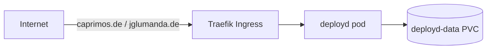

# Caprimos Website (deployd)

**deployd** is a self-hostable portfolio platform — and it powers the public
Caprimos site at <https://caprimos.de> (and `jglumanda.de`).

## What it is

- React 19 + TypeScript + Vite frontend, Express backend, one Docker image.
- **4 switchable themes** (Nordic, Terminal, Editorial, Brutalist).
- **GitHub integration**: imports projects, profile data and the profile README.
- Content managed through its own admin UI; data on a persistent volume.

## How it runs here

!!! info "Where things live"
    - **Source (this repo):** `Caprimos/deployd` — public, MIT-licensed.
    - **Deployment:** `Caprimos/deployd-gitops` — a `values.yaml` for the golden chart.
    - **Image:** `ghcr.io/caprimos/deployd` (public), pinned tag, bumped by Renovate.

## Deployment flow

1. GitHub **Release** on this repo → CI builds + pushes the image (tag without `v`).
2. **Renovate** proposes the tag bump in `deployd-gitops`; merge deploys via ArgoCD.
3. Runs in namespace `deployd`, apex ingress for both domains, data on a
   Retain PVC (`deployd-data`).

!!! tip "Platform docs"
    The golden chart, ArgoCD and the rest of the platform are documented on the
    **platform** System in Backstage.
